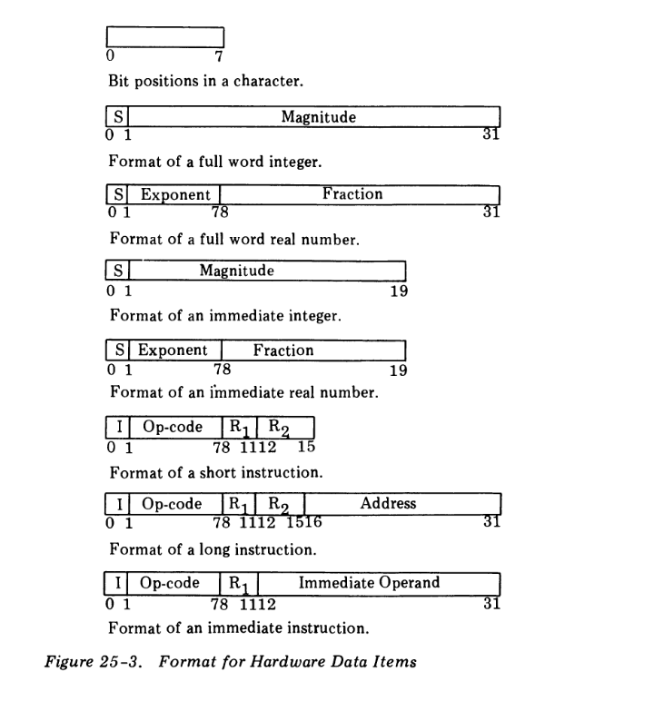
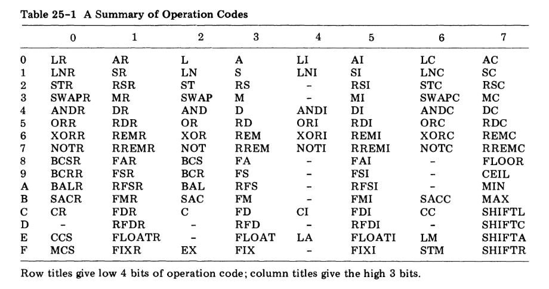

## Instruction formats

Instructions occur in **short** two-character format and **long** four-character format. All instructions
must begin on even-character boundaries; failure of the ILC to contain an even address at the 
beginning of an instruction execution cycle causes an _illegal instruction address exception_. The first 
character of every instruction contains the _indirect bit_ in bit 0 and the _operation code_ (the ```opcode```) in
bits 1 through 7. Not all opcodes are meaningful and not all instructions make use of the indirect
bit. An illegal opcode causes an _unimplemented instruction exception_. In most instructions, bits 8
through 11 designate either a general register or a 4-bit literal value used as a mask, and bits 12
through 15 designate a second general register.

Basically, there are four kinds of instructions: ```register-to-register``` (the two-character instructions),
```register-and-storage```, ```immediate```, and ```character```. Each class has its own characteristic interpretation
and addressing algorithm detailed here:

1. ```Register-to-register``` (```RR```) . In all register-to-register instructions, bits 12 through
15 designate a register used as one operand of the instruction. If the indirect bit is on, the operand is
located at the address given by bits 16 through 31 of the register designated by bits 12 through 15 of the
instruction. The value in bits 8 through 11 may designate either a register or a mask.
Instructions **CCS** and **MCS** do not make use of the indirect bit.

2. ```Register-and-Storage``` (```RS```). Register-and-storage instructions usually use bits 8 through 11
to designate a register or form a 4-bit mask to be used as one operand. The rest of the
instruction is used to form an _effective address_ with this algorithm:

   If the indirect bit is 0 and the _index register designator_ (bits 12 through 15) is 0,
   the effective address is given by the _address field_ (bits 16 through 31) of the
   instruction.
   
   If the indirect bit is zero and the index register designator is nonzero, the address field
   is extended to the left with zeros and added (two's complement, of course) to the
   value in the index register. Bits 16 through 31 of the result form the affected address.
   The value in the index register is not changed.
   
   If the indirect bit is nonzero and the index register designator is zero, the address field
   names a two-character _indirect field_ in memory. The contents of the indirect field
   form the effective address. If the indirect field does not begin on an even-character
   boundary, an _indirect address exception_ occurs.
   
   If both the indirect bit and the index register designator are nonzero, the indirect
   field is added to the index register value and the rightmost 16 bits of the sum form
   the effective address. An indirect address exception may occur.
   
3. ```Immediate``` (```IM```). All immediate instructions use bits 8 through 11 to designate a target
register and bits 12 through 31 to hold an _immediate operand_. The immediate operand
may be a 20-bit two's complement integer, a 20-bit logical vector, or a short-format real
number. The indirect bit is ignored by immediate instructions.

4. ```Character``` (```CH```). Character instructions operate the same way as register-and-storage
instructions.




## Instruction description (114 ops codes)

In this section we describe each of the instructions. The first line of a description is a short 
summary, giving the instruction name, its format (```RR```, ```RS```, ```IM```, ```CH```), its opcode in hexadecimal, its
assembly language format, and the possible condition code bits affected. A word description
follows the summary.
 
NOTE: In assembly language, the indirect bit is set by writing an asterisk before the address field, as in:
```
LN,R1 *A,R2
```

ATTENTION: Registers are referenced by they number not in format ```R<number>``` e.g. ```FAR, 2 1```

The code for the **CCR** effect is ```O``` (Overflow), ```L``` (Less than), ```G``` (Greater than),
```E``` (Equal) , and ```None``` (indicating that the **CCR** is unaffected).



Details:

  - [LR](#1-lr)
  - [L](#2-l)
  - [LI](#3-li)
  - [LC](#4-lc)
  - [LNR](#5-lnr)
  - [LN](#6-ln)
  - [LNI](#7-lni)
  - [LNC](#8-lnc)
  - [STR](#9-str)
  - [ST](#10-st)
  - [STC](#11-stc)
  - [SWAPR](#12-swapr)
  - [SWAP](#13-swap)
  - [SWAPC](#14-swapc)
  - [ANDR](#15-andr)
  - [AND](#16-and)
  - [ANDI](#17-andi)
  - [ANDC](#18-andc)
  - [ORR](#19-orr)
  - [OR](#20-or)
  - [ORI](#21-ori)
  - [ORC](#22-orc)
  - [XORR](#23-xorr)
  - [XOR](#24-xor)
  - [XORI](#25-xori)
  - [XORC](#26-xorc)
  - [NOTR](#27-notr)
  - [NOT](#28-not)
  - [NOTI](#29-noti)
  - [NOTC](#30-notc)
  - [BCSR](#31-bcsr)
  - [BCS](#32-bcs)
  - [BCRR](#33-bcrr)
  - [BCR](#34-bcr)
  - [BALR](#35-balr)
  - [BAL](#36-bal)
  - [SACR](#37-sacr)
  - [SAC](#38-sac)
  - [SACC](#39-sacc)
  - [CR](#40-cr)
  - [C](#41-c)
  - [CI](#42-ci)
  - [CC](#43-cc)
  - [CCS](#44-ccs)
  - [MCS](#45-mcs)
  - [SVC](#46-svc)
  - [EX](#47-ex)
  - [LA](#48-la)
  - [LM](#49-lm)
  - [STM](#50-stm)
  - [AR](#51-ar)
  - [A](#52-a)
  - [AI](#53-ai)
  - [AC](#54-ac)
  - [SR](#55-sr)
  - [S](#56-s)
  - [SI](#57-si)
  - [SC](#58-sc)
  - [RSR](#59-rsr)
  - [RS](#60-rs)
  - [RSI](#61-rsi)
  - [RSC](#62-rsc)
  - [MR](#63-mr)
  - [M](#64-m)
  - [MI](#65-mi)
  - [MC](#66-mc)
  - [DR](#67-dr)
  - [D](#68-d)
  - [DI](#69-di)
  - [DC](#70-dc)
  - [RDR](#71-rdr)
  - [RD](#72-rd)
  - [RDI](#73-rdi)
  - [RDC](#74-rdc)
  - [REMR](#75-remr)
  - [REM](#76-rem)
  - [REMI](#77-remi)
  - [REMC](#78-remc)
  - [RREMR](#79-rremr)
  - [RREM](#80-rrem)
  - [RREMI](#81-rremi)
  - [RREMC](#82-rremc)
  - [FAR](#83-far)
  - [FA](#84-fa)
  - [FAI](#85-fai)
  - [FSR](#86-fsr)
  - [FS](#87-fs)
  - [FSI](#88-fsi)
  - [RFSR](#89-rfsr)
  - [RFS](#90-rfs)
  - [RFSI](#91-rfsi)
  - [FMR](#92-fmr)
  - [FM](#93-fm)
  - [FMI](#94-fmi)
  - [FDR](#95-fdr)
  - [FD](#96-fd)
  - [FDI](#97-fdi)
  - [RFDR](#98-rfdr)
  - [RFD](#99-rfd)
  - [RFDI](#100-rfdi)
  - [FLOATR](#101-floatr)
  - [FLOAT](#102-float)
  - [FLOATI](#103-floati)
  - [FIXR](#104-fixr)
  - [FIX](#105-fix)
  - [FIXI](#106-fixi)
  - [FLOOR](#107-floor)
  - [CEIL](#108-ceil)
  - [MIN](#109-min)
  - [MAX](#110-max)
  - [SHIFTL](#111-shiftl)
  - [SHIFTC](#112-shiftc)
  - [SHIFTA](#113-shifta)
  - [SHIFTR](#114-shiftr)

p. 111 (10 ops codes)

### 1. LR

| ```Instruction name```  | ```Format``` | ```OpCode(hex)``` | ```Assembly language``` | ```CCR effect``` |
|:-----------------:|:------:|:-----------:|:-----------------:|:----------:|
|   Load Register   |   RR   |     00      |    ```LR, R1 R2```       |    GLE     |

The register R1 is loaded with the word at the effective address. The load value is compared
with zero and the G, L, or E bit of the CCR set as appropriate. If the effective address does
not fall on a word boundary, a _word-addressing exception_ occurs.

NOTE: In a comparison to set the CCR, the final result is assumed to hold if the first operand mentioned is on the left of
      the relation and the second on the right. That is, if the result is less than, it means that the first operand is less than
      the second.

### 2. L

| ```Instruction name```  | ```Format``` | ```OpCode(hex)``` | ```Assembly language``` | ```CCR effect``` |
|:-----------------:|:------:|:-----------:|:-----------------:|:----------:|
|       Load        |   RS   | 20   |   ```L, R1 A, R2```              |    GLE     |

This instruction operates in the same way as the ```Load Register``` instruction except that the
effective address is calculated by using the ```register-and-storage``` addressing algorithm.

### 3. LI

| ```Instruction name```  | ```Format``` | ```OpCode(hex)``` | ```Assembly language``` | ```CCR effect``` |
|:-----------------:|:------:|:-----------:|:-----------------:|:----------:|
|     Load Immediate              |   IM     |     40        |       ```LI, R1 I```            |    GLE        |

This instruction operates like the ```Load Register``` instruction except that the loaded value is
the immediate operand I with its sign bit extended left 12 bits. No exceptions can occur.

### 4. LC

| ```Instruction name```  | ```Format``` | ```OpCode(hex)``` | ```Assembly language``` | ```CCR effect``` |
|:-----------------:|:------:|:-----------:|:-----------------:|:----------:|
|      Load Character             |  CH    |    60         |      ```LC, R1 A, R2```               |      GE      |

Register R1 is cleared to zero, and the character at the effective address is loaded into bits
24 through 31. The loaded value is compared to zero and either the G or E bit of the CCR set.

### 5. LNR
 
| ```Instruction name```  | ```Format``` | ```OpCode(hex)``` | ```Assembly language``` | ```CCR effect``` |
|:-----------------:|:------:|:-----------:|:-----------------:|:----------:|
|    Load Negative Register               |   RR     |    01         |       ```LNR, R1 R2```     |     OGLE       |

The register R1 is loaded with the two's complement of the word at the effective address.
The loaded result is compared to zero to set the CCR. If overflow occurs, only the O bit of
the CCR is set. A _word-addressing exception_ may occur.

### 6. LN

| ```Instruction name```  | ```Format``` | ```OpCode(hex)``` | ```Assembly language``` | ```CCR effect``` |
|:-----------------:|:------:|:-----------:|:-----------------:|:----------:|
|      Load Negative             |   RS     |    21         |       ```LN, R1 A, R2```            |     OGLE        |

This instruction operates in the same way as ```Load Negative Register``` except that the 
effective address is calculated by the ```register-and-storage``` addressing algorithm.

### 7. LNI

| ```Instruction name```  | ```Format``` | ```OpCode(hex)``` | ```Assembly language``` | ```CCR effect``` |
|:-----------------:|:------:|:-----------:|:-----------------:|:----------:|
|    Load Negative Immediate               |    IM    |     41        |    ```LNI, R1 I```   |      GLE      |
 
The value loaded into register R1 is the 32-bit two's complement of the 20-bit two's 
complement value I. Overflow cannot occur. The CCR is set by comparing the loaded value with
zero.

### 8. LNC

| ```Instruction name```  | ```Format``` | ```OpCode(hex)``` | ```Assembly language``` | ```CCR effect``` |
|:-----------------:|:------:|:-----------:|:-----------------:|:----------:|
|       Load Negative Character            |    CH      |      61       |     ```LNC, R1 A, R2```   |    LE         |
 
The character at the effective address is extended leftward 24 bits with zeros and the 
resulting word complemented and loaded into register R1. Overflow cannot occur. The loaded
value is compared with zero to set the CCR.

### 9. STR

| ```Instruction name```  | ```Format``` | ```OpCode(hex)``` | ```Assembly language``` | ```CCR effect``` |
|:-----------------:|:------:|:-----------:|:-----------------:|:----------:|
|       Store Register            |    RR    |   02       |     ```STR, R1 R2```              |     GLE        |
   
The value in R1 is stored in the word at the effective address. The stored value is compared
to zero to set the CCR. A _word-addressing exception_ may occur.

### 10. ST

| ```Instruction name```  | ```Format``` | ```OpCode(hex)``` | ```Assembly language``` | ```CCR effect``` |
|:-----------------:|:------:|:-----------:|:-----------------:|:----------:|
|       Store            |   RS     |     22         |      ```ST, R1 A, R2```              |    GLE        |
  
This instruction operates in the same way as the ```Store Register``` instruction with the effective
address calculated by the ```register-and-storage``` addressing algorithm.

p. 112 (14 ops codes)

### 11. STC

| ```Instruction name```  | ```Format``` | ```OpCode(hex)``` | ```Assembly language``` | ```CCR effect``` |
|:-----------------:|:------:|:-----------:|:-----------------:|:----------:|
|      Store Character             |   CH     |    62         |      ```STC, R1 A, R2```             |    GE        |

Bits 24 through 31 are stored in the character at the effective address. The stored value is
compared to zero to set the CCR.

### 12. SWAPR

| ```Instruction name```  | ```Format``` | ```OpCode(hex)``` | ```Assembly language``` | ```CCR effect``` |
|:-----------------:|:------:|:-----------:|:-----------------:|:----------:|
|       Swap Register            |   RR     |     03        |   ```SWAPR, R1 R2```                |    GLE        |

    
The word in register R1 is exchanged with the word at the effective address. The CCR is
set by comparing the value moved into register R1 with zero. A _word-addressing exception_ may occur.

### 13. SWAP

| ```Instruction name```  | ```Format``` | ```OpCode(hex)``` | ```Assembly language``` | ```CCR effect``` |
|:-----------------:|:------:|:-----------:|:-----------------:|:----------:|
|       Swap            |    RS    |     23        |     ```SWAP, R1 A, R2```              |     GLE       |
    
This instruction operates in the same way as the ```Swap Register``` instruction with the 
effective address calculated by the ```register-and-storage``` algorithm.

### 14. SWAPC

| ```Instruction name```  | ```Format``` | ```OpCode(hex)``` | ```Assembly language``` | ```CCR effect``` |
|:-----------------:|:------:|:-----------:|:-----------------:|:----------:|
|  Swap Character                 |  CH      |    63         |     ```SWAPC, R1 A, R2```              |   GE         |
    
Bits 24 through 31 are exchanged with the character at the effective address. The CCR is
set by comparing the character loaded into the register with zero. Bits 0 through 23 of
register R1 are not affected.

### 15. ANDR

| ```Instruction name```  | ```Format``` | ```OpCode(hex)``` | ```Assembly language``` | ```CCR effect``` |
|:-----------------:|:------:|:-----------:|:-----------------:|:----------:|
|  ```AND``` Register                 |  RR      |      04       |     ```ANDR, R1 R2```              |    GLE        |
    
The logical ```AND``` of the word in R1 and the word at the effective address is formed and
loaded into register R1. Bit G of the CCR is set if the final value in R1 is all ones, bit L
is set if the result if mixed zeros and ones, and bit E is set if the result is all zeros.
A _word-addressing exception_ may occur.

### 16. AND

| ```Instruction name```  | ```Format``` | ```OpCode(hex)``` | ```Assembly language``` | ```CCR effect``` |
|:-----------------:|:------:|:-----------:|:-----------------:|:----------:|
|   ```AND```                |  RS      |    24         |    ```AND, R1 A, R2```               |    GLE        |
  
This instruction operates like the ```And Register``` except that the ```register-and-storage```
addressing algorithm is used to calculate the effective address.

### 17. ANDI

| ```Instruction name```  | ```Format``` | ```OpCode(hex)``` | ```Assembly language``` | ```CCR effect``` |
|:-----------------:|:------:|:-----------:|:-----------------:|:----------:|
|    ```AND``` Immediate               |  IM      |  44           |   ```ANDI, R1 I```                |     LE       |

The logical ```AND``` of the word in register R1 and the 20-bit immediate value I extended on the
left with 12 zero bits is stored in R1. The CCR is set in the same way as the ```And Register``` instruction.

### 18. ANDC

| ```Instruction name```  | ```Format``` | ```OpCode(hex)``` | ```Assembly language``` | ```CCR effect``` |
|:-----------------:|:------:|:-----------:|:-----------------:|:----------:|
|   ```AND``` Character               |   CH     |   64          |   ```ANDC, R1 A, R2```                |  GLE          |

The character at the effective address is ANDed with bits 24 through 31 of register R1 and
the result is replaced in bits 24 through 31 of R1. Bits 0 through 23 of R1 are not affected.
The CCR is set in the same way as the ```And Register``` instruction.

### 19. ORR

| ```Instruction name```  | ```Format``` | ```OpCode(hex)``` | ```Assembly language``` | ```CCR effect``` |
|:-----------------:|:------:|:-----------:|:-----------------:|:----------:|
|    ```OR``` Register               | RR       |   05          |    ```ORR, R1 R2```               |    GLE        |
    
This instruction operates in the same way as the ```And Register``` with logical ```OR``` replacing
logical ```AND```.

### 20. OR

| ```Instruction name```  | ```Format``` | ```OpCode(hex)``` | ```Assembly language``` | ```CCR effect``` |
|:-----------------:|:------:|:-----------:|:-----------------:|:----------:|
|    ```OR```       | RS       |   25          |    ```OR,R1 A,R2```               |    GLE        |

This instruction operates in the same way as ```AND``` with logical ```OR``` replacing logical ```AND```.

### 21. ORI

| ```Instruction name```  | ```Format``` | ```OpCode(hex)``` | ```Assembly language``` | ```CCR effect``` |
|:-----------------:|:------:|:-----------:|:-----------------:|:----------:|
|     ```OR``` Immediate              | IM       |    45         |   ```ORI, R1 I```                 |    GLE        |

This instruction operates in the same way as ```And Immediate``` with logical ```AND``` replaced by logical ```OR```.

### 22. ORC

| ```Instruction name```  | ```Format``` | ```OpCode(hex)``` | ```Assembly language``` | ```CCR effect``` |
|:-----------------:|:------:|:-----------:|:-----------------:|:----------:|
|  ```OR``` Character                 | CH       |   65          |    ```ORC, R1 A, R2```               |     GLE       |

This instruction operates in the same way as ```And Character``` with logical and replaced by logical ```OR```.

### 23. XORR

| ```Instruction name```  | ```Format``` | ```OpCode(hex)``` | ```Assembly language``` | ```CCR effect``` |
|:-----------------:|:------:|:-----------:|:-----------------:|:----------:|
|   Exclusive ```OR``` Register                | RR       |   06          |    ```XORR, R1 R2```               |  GLE          |
    
This instruction operates in the same way as ```And Register``` with logical ```AND``` replaced by 
logical ```exclusive OR```.

### 24. XOR

| ```Instruction name```  | ```Format``` | ```OpCode(hex)``` | ```Assembly language``` | ```CCR effect``` |
|:-----------------:|:------:|:-----------:|:-----------------:|:----------:|
|  Exclusive ```OR```                 |  RS      | 26            |  ```XOR, R1 A, R2```                 |       GLE         |

This instruction operates in the same way as ```And``` with logical ```AND``` replaced by logical
```exclusive OR```.

p. 113 (14 ops codes)

### 25. XORI

| ```Instruction name```  | ```Format``` | ```OpCode(hex)``` | ```Assembly language``` | ```CCR effect``` |
|:-----------------:|:------:|:-----------:|:-----------------:|:----------:|
|   Exclusive OR Immediate                | IM       |  46           |    ```XORI, R1 I```               |    GLE        |

This instruction operates in the same way as ```And Immediate``` with logical ```AND``` replaced by
logical ```exclusive OR```.

### 26. XORC

| ```Instruction name```  | ```Format``` | ```OpCode(hex)``` | ```Assembly language``` | ```CCR effect``` |
|:-----------------:|:------:|:-----------:|:-----------------:|:----------:|
|  Exclusive OR Character                 | CH       |    66         |   ```XORC, R1 A, R2```                |  GLE          |

This instruction operates in the same as ```And Character``` with logical ```AND``` replaced by logical
```exclusive OR```.

### 27. NOTR

| ```Instruction name```  | ```Format``` | ```OpCode(hex)``` | ```Assembly language``` | ```CCR effect``` |
|:-----------------:|:------:|:-----------:|:-----------------:|:----------:|
|  ```NOT``` Register                  |  RR      |   07          |    ```NOTR, R1 R2```               |  GLE          |
    
This instruction operates in the same way as ```And Register``` with logical ```AND``` replaced by
logical complement of the second operand, the original value in register R1 being ignored.

### 28. NOT

| ```Instruction name```  | ```Format``` | ```OpCode(hex)``` | ```Assembly language``` | ```CCR effect``` |
|:-----------------:|:------:|:-----------:|:-----------------:|:----------:|
| ```NOT```         |   RS   |  27         |```NOT, R1 A, R2```|   GLE      |

This instruction operates in the same way as ```And``` with logical ```AND``` replaced by logical 
complement of the second operand, the original value in register R1 being ignored.

### 29. NOTI

| ```Instruction name```  | ```Format``` | ```OpCode(hex)``` | ```Assembly language``` | ```CCR effect``` |
|:-----------------:|:------:|:-----------:|:-----------------:|:----------:|
|  NOT Immediate                 | IM       |   47          | ```NOTI, R1 I```   |  GLE          |

This instruction operates in the same way as ```And Immediate``` with logical ```AND``` replaced by
logical complement of the extended immediate value, the original value in register R1 being ignored.

### 30. NOTC

| ```Instruction name```  | ```Format``` | ```OpCode(hex)``` | ```Assembly language``` | ```CCR effect``` |
|:-----------------:|:------:|:-----------:|:-----------------:|:----------:|
|   NOT Character                |  CH      |   67          |   ```NOTC, R1 A, R2```                |    GLE        |

This instruction operates in the same way as ```And Character``` with logical ```AND``` replaced by
logical complement of the second operand, the original value of bits 24 through 31 of register R1 being ignored.

### 31. BCSR

| ```Instruction name```  | ```Format``` | ```OpCode(hex)``` | ```Assembly language``` | ```CCR effect``` |
|:-----------------:|:------:|:-----------:|:-----------------:|:----------:|
|Branch Conditions Set Register| RR       |  08           |   ```BCSR ,M1 R2```               |   None         |

If the logical ```AND``` of the contents of the CCR and the 4-bit logical mask M1 is nonzero,
the contents of the ILC are replaced by the effective address.

### 32. BCS

| ```Instruction name```  | ```Format``` | ```OpCode(hex)``` | ```Assembly language``` | ```CCR effect``` |
|:-----------------:|:------:|:-----------:|:-----------------:|:----------:|
|Branch Conditions Set                   | RS       |  28           |   ```BCS, M1 A, R2```                 |  None          |
  
This instruction operates in the same way as ```Branch Conditions Set Register``` with the 
effective address calculated by the ```register-and-storage``` addressing algorithm.

### 33. BCRR

| ```Instruction name```  | ```Format``` | ```OpCode(hex)``` | ```Assembly language``` | ```CCR effect``` |
|:-----------------:|:------:|:-----------:|:-----------------:|:----------:|
|Branch Conditions Reset Register                   | RR       | 09            |  ```BCRR, M1 R2```                 |     None       |
    
If the logical ```AND``` of the contents of the CCR and the 4-bit logical mask M1 is zero, the 
contents of the ILC are replaced by the effective address.

### 34. BCR

| ```Instruction name```  | ```Format``` | ```OpCode(hex)``` | ```Assembly language``` | ```CCR effect``` |
|:-----------------:|:------:|:-----------:|:-----------------:|:----------:|
|Branch Condition Reset                   |  RS      |  29           | ```BCR, M1 A, R2```                  |   None         |
    
This instruction operates in the same way as ```Branch Conditions Reset Register``` with the
effective address calculated by the ```register-and-storage``` addressing algorithm.

### 35. BALR

| ```Instruction name```  | ```Format``` | ```OpCode(hex)``` | ```Assembly language``` | ```CCR effect``` |
|:-----------------:|:------:|:-----------:|:-----------------:|:----------:|
|Branch and Link Register                   | RR       |    0A         |  ```BALR, R1 R2```                 |    None        |

The current contents of the ILC are loaded into register R1 and the effective address is
loaded into the ILC. If the _indirect bit_ is not ```ON```, the effective address is register designator
R2 multiplied by 4.

### 36. BAL

| ```Instruction name```  | ```Format``` | ```OpCode(hex)``` | ```Assembly language``` | ```CCR effect``` |
|:-----------------:|:------:|:-----------:|:-----------------:|:----------:|
|Branch and Link                   | RS       |   2A          |   ```BAL, R1 A, R2```                |   None         |

The current contents of the ILC are stored in register R1 and the ILC is loaded with the
effective address of the instruction.

### 37. SACR

| ```Instruction name```  | ```Format``` | ```OpCode(hex)``` | ```Assembly language``` | ```CCR effect``` |
|:-----------------:|:------:|:-----------:|:-----------------:|:----------:|
|Save Condition Register                   |  RR      |   0B          |    ```SACR, M1 R2```               |   None         |

If the logical ```AND``` of the CCR and the 4-bit mask field M1 is nonzero, a word of all **one** bits
is stored in the effective address; otherwise a word of all **zeros** is stored.
A _word-addressing exception_ may occur.

### 38. SAC

| ```Instruction name```  | ```Format``` | ```OpCode(hex)``` | ```Assembly language``` | ```CCR effect``` |
|:-----------------:|:------:|:-----------:|:-----------------:|:----------:|
|Save Condition                   |  RS      |   2B          |    ```SAC, M1 A, R2```               |   None         |

This instruction operates in the same way as the ```Store Conditions Register``` instruction with
the effective address calculated by the ```register-and-storage addressing``` algorithm.

p. 114 (7 ops codes)

### 39. SACC

| ```Instruction name```  | ```Format``` | ```OpCode(hex)``` | ```Assembly language``` | ```CCR effect``` |
|:-----------------:|:------:|:-----------:|:-----------------:|:----------:|
|Save Condition Character                   | CH       |   6B          | ```SACC, M1 A, R2```                  |   None         |
   
If the logical ```AND``` of the CCR and the 4 bit mask field M1 is nonzero, a character of all **one**
bits is stored at the effective address; otherwise a character of all **zero** bits is stored.

### 40. CR

| ```Instruction name```  | ```Format``` | ```OpCode(hex)``` | ```Assembly language``` | ```CCR effect``` |
|:-----------------:|:------:|:-----------:|:-----------------:|:----------:|
| Compare Register                  | RR       |     0C        |   ```CR, R1 R2```                 |     GLE       |
   
The results of an algebraic comparison between the contents of register R1 and the word at
the effective address are used to set the G, L, or E bits of the CCR as appropriate.
A _word-addressing exception_ may occur.

### 41. C

| ```Instruction name```  | ```Format``` | ```OpCode(hex)``` | ```Assembly language``` | ```CCR effect``` |
|:-----------------:|:------:|:-----------:|:-----------------:|:----------:|
|  Compare                 |  RS      |  2C           |    ```C, R1 A, R2```               |    GLE         |
   
This instruction operates the same way as ```Compare Register``` except that the effective 
address is calculated by the ```register-and-storage``` addressing algorithm.

### 42. CI

| ```Instruction name```  | ```Format``` | ```OpCode(hex)``` | ```Assembly language``` | ```CCR effect``` |
|:-----------------:|:------:|:-----------:|:-----------------:|:----------:|
| Compare Immediate                  | IM       |   4C          |     ``` CI, R1, I```             |  GLE          |
    
The 32-bit value in register R1 is compared algebraically with the 32-bit value constructed
by propagating the immediate operand's sign bit leftward 12 bits, and the result is used to
set the G, L, or E bit of the CCR as appropriate.

### 43. CC

| ```Instruction name```  | ```Format``` | ```OpCode(hex)``` | ```Assembly language``` | ```CCR effect``` |
|:-----------------:|:------:|:-----------:|:-----------------:|:----------:|
|  Compare Character                 |  CH      |  6C           |     ```CC, R1 A, R2```              | GLE           |
 
Bits 24 through 31 of register R1 are compared as an 8-bit positive integer with the 
character at the effective address, and the result is used to set the G, L, or E bit of the CCR as
appropriate.

### 44. CCS

| ```Instruction name```  | ```Format``` | ```OpCode(hex)``` | ```Assembly language``` | ```CCR effect``` |
|:-----------------:|:------:|:-----------:|:-----------------:|:----------:|
| Compare Character String                  | RR       |  0E           |    ```CCS, M1 R2```               |    GLE        |
    
Register designator R2 names a register pair R2 and (R2+1) mod 16 (the second register
will be called R2+1 throughout). The pair R2 and R2+1 should contain a string descriptor
doubleword, with a character address A1 in bits 16 through 31 of register R2, a length L in
bits 0 through 15 of register R2+1, and a character address A2 in bits 16 through 31 of
register R2+1. To begin execution, A1, A2, and L are moved to internal registers, the CCR is
set to zero, and the E bit of the CCR is set to one. A loop is started.

- First, if L is zero, bits 0 through 15 of both registers are set to zero, bits 16 to 31 of R2
  are set to the internal value of A1, bits 16 through 31 of R2+1 are set to the internal
  value of A2, and the instruction terminates.

- Second, the character of A1 is compared as an 8-bit integer to the character at A2 and the
  result used to set the appropriate bits of the CCR.

- Third, if the E bit of the CCR is not one, bits 0 through 15 of register R2 are set to
  zero, bits 16 through 31 of R2 to the internal value of A1, bits 0 through 15 of R2+1
  to the internal value of L, bits 16 through 31 of R2+1 to the internal value of A2, and
  the instruction terminates.

- Finally, L is decremented by 1, A1 is incremented by the mask M1 interpreted as a 4-bit
  two's complement integer, and A2 is incremented by 1, and the loop returns to the
  first step.

### 45. MCS

| ```Instruction name```  | ```Format``` | ```OpCode(hex)``` | ```Assembly language``` | ```CCR effect``` |
|:-----------------:|:------:|:-----------:|:-----------------:|:----------:|
| Move Character String                  | RR       |   0F          |    ```MCS, M1 R2```               | None           |

Registers R2 and (R2+1) mod 16 contain a string descriptor doubleword as described in
```Compare Character String```. The L, A1, and A2 fields are loaded into internal registers. A
loop is begun.

- First, if L is zero, bits 0 through 15 of registers R2 and R2+1 are set to zero, bits 16
  through 31 of R2 to A1, bits 16 through 31 of R2+1 to A2, and the instruction terminates.

- Second, the character at location A1 is stored at character location A2.

- Third, L is decremented by 1 and A2 is incremented by 1.

- Finally, A1 is incremented by the mask M1 interpreted as a 4-bit two's complement
  integer and the loop returns to its first step.

p. 115 (12 ops codes)

### 46. SVC

| ```Instruction name```  | ```Format``` | ```OpCode(hex)``` | ```Assembly language``` | ```CCR effect``` |
|:-----------------:|:------:|:-----------:|:-----------------:|:----------:|
| Supervisor Call                  |  RS      |  2E           |  ```SVC, R1 A, R2```                 |   None         |

Program execution is interrupted and a call made to a controlling supervisor program.

### 47. EX

| ```Instruction name```  | ```Format``` | ```OpCode(hex)``` | ```Assembly language``` | ```CCR effect``` |
|:-----------------:|:------:|:-----------:|:-----------------:|:----------:|
|  Execute                 | RS       |  2F           |  ```EX, R1 A, R2```                 |  None          |

The instruction at the effective address is executed. The effects of the subject instruction
become the effects of the Execute instruction. If the effective address is **not even**, an
_execute address exception_ occurs. **Execute instructions may be nested to any depth**. Note
that the ILC is changed only if explicitly modified by the subject instruction.

### 48. LA

| ```Instruction name```  | ```Format``` | ```OpCode(hex)``` | ```Assembly language``` | ```CCR effect``` |
|:-----------------:|:------:|:-----------:|:-----------------:|:----------:|
|Load Address                   |  RS      |    4E         |      ```LA, R1 A, R2```             |    None        |
    
Register R1 is loaded with the instruction's effective address.

### 49. LM

| ```Instruction name```  | ```Format``` | ```OpCode(hex)``` | ```Assembly language``` | ```CCR effect``` |
|:-----------------:|:------:|:-----------:|:-----------------:|:----------:|
| Load Multiple                  |RS        |   6E          | ```LM, R1 A, R2```                  |     None       |

Registers R1 through R2 are loaded from consecutive words in memory, beginning at the
effective address (the effective address is calculated by assuming that the index register
designator is zero). If R2 is less than R1, registers R1 through 15 and 0 through R2 are
loaded. A _word-addressing exception_ may occur.

### 50. STM

| ```Instruction name```  | ```Format``` | ```OpCode(hex)``` | ```Assembly language``` | ```CCR effect``` |
|:-----------------:|:------:|:-----------:|:-----------------:|:----------:|
| Store Multiple                  | RS       |   6F          |   ```STM, R1 A, R2```                |   None         |

Registers R1 through R2 are stored into consecutive words of memory, beginning at the
effective address (the effective address is calculated by assuming the index register 
designator is zero). If R2 is less than R1, registers R1 through 15 and 0 through R2 are stored.
A _word-addressing exception_ may occur.

### 51. AR

| ```Instruction name```  | ```Format``` | ```OpCode(hex)``` | ```Assembly language``` | ```CCR effect``` |
|:-----------------:|:------:|:-----------:|:-----------------:|:----------:|
|Add Register                   |  RR      |  10           |     ```AR, R1 R2```              |   OGLE         |
   
The word in R1 is added to the word at the effective address and the result is placed in R1.
The sum is compared to zero to set the CCR. If _overflow occurs_, only the **O** bit of the CCR
is set. A _word-addressing exception_ may occur.

### 52. A

| ```Instruction name```  | ```Format``` | ```OpCode(hex)``` | ```Assembly language``` | ```CCR effect``` |
|:-----------------:|:------:|:-----------:|:-----------------:|:----------:|
| Add               |   RS     |   30          | ```A, R1 A, R2```                  |   OGLE         |
    
This instruction operates in the same way as ```Add Register``` with the effective address 
calculated by the ```register-and-storage``` addressing algorithm.

### 53. AI

| ```Instruction name```  | ```Format``` | ```OpCode(hex)``` | ```Assembly language``` | ```CCR effect``` |
|:-----------------:|:------:|:-----------:|:-----------------:|:----------:|
| Add Immediate                  |  IM      |   50          |    ```AI, R1 I```               |   OGLE         |

    
The 20-bit two's complement immediate operand I is added to the value in register R1 and
the sum stored in R1. The sum is compared to zero to set the CCR. If _overflow occurs_, only
the **O** bit of the CCR is set.

### 54. AC

| ```Instruction name```  | ```Format``` | ```OpCode(hex)``` | ```Assembly language``` | ```CCR effect``` |
|:-----------------:|:------:|:-----------:|:-----------------:|:----------:|
|Add Character                   |   CH     |  70           |  ```AC, R1 A, R2```                 |   OGLE         |

   
The character at the effective address is extended 24 bits to the left with zeros and added to
the value in register R1 with the result loaded into R1. The sum is compared to zero to set
the CCR. If _overflow occurs_, only the **O** bit of the CCR is set.

### 55. SR

| ```Instruction name```  | ```Format``` | ```OpCode(hex)``` | ```Assembly language``` | ```CCR effect``` |
|:-----------------:|:------:|:-----------:|:-----------------:|:----------:|
|  Subtract Register                 | RR       |   11          |    ```SR, R1 R2```               |   OGLE         |
    
The word at the effective address (the subtrahend) is subtracted from the value in register
R1 (the minuend) and the difference is stored in R1. The difference is compared to zero to
set the CCR. If _overflow occurs_, only the **O** bit of the CCR is set. A _word-addressing exception_ may occur.

### 56. S

| ```Instruction name```  | ```Format``` | ```OpCode(hex)``` | ```Assembly language``` | ```CCR effect``` |
|:-----------------:|:------:|:-----------:|:-----------------:|:----------:|
|  Subtract                 |   RS     |    31         |    ```S, R1 A, R2```               |    OGLE        |

    
This instruction operates the same way as ```Subtract Register``` with the effective address
calculated by the ```register-and-storage``` addressing algorithm.

### 57. SI

| ```Instruction name```  | ```Format``` | ```OpCode(hex)``` | ```Assembly language``` | ```CCR effect``` |
|:-----------------:|:------:|:-----------:|:-----------------:|:----------:|
|  Subtract Immediate                 |   IM     |   51          |    ```SI, R1 I```               |    OGLE        |
    
The 20-bit two's complement integer immediate operand I (the subtrahend) is subtracted
from the value in register R1 (the minuend) and the result stored in register R1. The difference
is compared to zero to set the CCR. If _overflow occurs_, only the **O** bit of the CCR is set.

p. 116 (12 ops codes)

### 58. SC

| ```Instruction name```  | ```Format``` | ```OpCode(hex)``` | ```Assembly language``` | ```CCR effect``` |
|:-----------------:|:------:|:-----------:|:-----------------:|:----------:|
| Subtract Character                  |   CH     |    71         |    ```SC, R1 A, R2```               |   OGLE         |
   
The character at the effective address (the subtrahend), treated as a positive integer by
extension 24 bits leftward with zeros, is subtracted from the value in register R1 (the
minuend) and the result stored in R1. The difference is compared to zero to set the CCR.
If _overflow occurs_, only the **O** bit of the CCR is set.

### 59. RSR

| ```Instruction name```  | ```Format``` | ```OpCode(hex)``` | ```Assembly language``` | ```CCR effect``` |
|:-----------------:|:------:|:-----------:|:-----------------:|:----------:|
| Reverse Subtract Register                  |  RR      |    12         |    ```RSR, R1 R2```               |    OGLE        |
    
This instruction operates the same way as the ```Subtract Register``` instruction except that the
roles of the minuend and the subtrahend are reversed.

NOTE: In all the reversed instructions, although the roles of the two operand values are interchanged, the
      result is still stored in the same place.

### 60. RS

| ```Instruction name```  | ```Format``` | ```OpCode(hex)``` | ```Assembly language``` | ```CCR effect``` |
|:-----------------:|:------:|:-----------:|:-----------------:|:----------:|
| Reverse Subtract                  | RS       |  32           |    ```RS, R1 A, R2```               |  OGLE          |
    
This instruction operates the same way as ```Subtract``` except that the roles of the minuend
and the subtrahend are reversed.

### 61. RSI

| ```Instruction name```  | ```Format``` | ```OpCode(hex)``` | ```Assembly language``` | ```CCR effect``` |
|:-----------------:|:------:|:-----------:|:-----------------:|:----------:|
| Reverse Subtract Immediate                  |  IM      |   52          |     ```RSI, R1 I```              |  OGLE          |
    
This instruction operates the same way as ```Subtract Immediate``` except that the roles of the
minuend and the subtrahend are reversed.

#### 62. RSC

| ```Instruction name```  | ```Format``` | ```OpCode(hex)``` | ```Assembly language``` | ```CCR effect``` |
|:-----------------:|:------:|:-----------:|:-----------------:|:----------:|
| Reverse Subtract Character                  |    CH    |   72          |   ```RSC, R1 A, R2```                |    OGLE        |
    
This instruction operates the same way as the ```Subtract Character``` with the roles of the
minuend and the subtrahend reversed.

### 63. MR

| ```Instruction name```  | ```Format``` | ```OpCode(hex)``` | ```Assembly language``` | ```CCR effect``` |
|:-----------------:|:------:|:-----------:|:-----------------:|:----------:|
| Multiply Register                  | RR       |    13         |    ```MR, R1 R2```               |     OGLE       |
    
The value in register R1 and the word at the effective address are multiplied and the low-
order 32 bits of the product are stored in register R1. The result in register R1 is compared
to zero to set the CCR. If _overflow occurs_, only the **O** bit of the CCR is set.
A _word-addressing exception_ may occur.

### 64. M

| ```Instruction name```  | ```Format``` | ```OpCode(hex)``` | ```Assembly language``` | ```CCR effect``` |
|:-----------------:|:------:|:-----------:|:-----------------:|:----------:|
|  Multiply                 |  RS      |    33         |   ```M, R1 A, R2```                |     OGLE       |
    
This instruction operates the same way as ```Multiply Register``` except that the effective 
address is calculated by the ```register-and-storage``` addressing algorithm.

### 65. MI

| ```Instruction name```  | ```Format``` | ```OpCode(hex)``` | ```Assembly language``` | ```CCR effect``` |
|:-----------------:|:------:|:-----------:|:-----------------:|:----------:|
| Multiply Immediate                  |  IM      |   53          |   ```MI, R1 I```                |    OGLE        |
    
The low 32 bits of the product of the value in register R1 and the 20-bit immediate value I
are stored in register R1. The product in register R1 is compared to zero to set the CCR.
If _overflow occurs_, only the **O** bit of the CCR is set.

### 66. MC

| ```Instruction name```  | ```Format``` | ```OpCode(hex)``` | ```Assembly language``` | ```CCR effect``` |
|:-----------------:|:------:|:-----------:|:-----------------:|:----------:|
|  Multiply Character                 |  CH      |   73          |        ```MC, R1 A, R2```          |  OGLE          |
    
The low 32 bits of the product of the value in register R1 and the positive 8-bit integer
in the character at the effective address are stored in register R1. The value in register R1
is compared to zero to set the CCR. If _overflow occurs_, only the **O** bit of the CCR is set.

### 67. DR

| ```Instruction name```  | ```Format``` | ```OpCode(hex)``` | ```Assembly language``` | ```CCR effect``` |
|:-----------------:|:------:|:-----------:|:-----------------:|:----------:|
|   Divide Register                | RR       |  14           |   ```DR, R1 R2```                |    OGLE        |
    
The value in register R1 (the _dividend_) is divided by the word at the effective address (the
_divisor_) and the quotient is stored in register R1. The quotient is selected so that the 
remainder is non negative. The quotient is compared to zero to set the CCR. If _overflow
occurs_, only the **O** bit of the CCR is set. A _word-addressing exception_ may occur. If
the divisor is zero, the _zero divisor exception_ occurs and register R1 is unchanged.

### 68. D

| ```Instruction name```  | ```Format``` | ```OpCode(hex)``` | ```Assembly language``` | ```CCR effect``` |
|:-----------------:|:------:|:-----------:|:-----------------:|:----------:|
|   Divide                |   RS     |   34          |    ```D, R1 A, R2```               |   OGLE         |

   
This instruction operates the same way as ```Divide Register``` except that the effective address
is calculated with the register-and-storage addressing algorithm.

### 69. DI

| ```Instruction name```  | ```Format``` | ```OpCode(hex)``` | ```Assembly language``` | ```CCR effect``` |
|:-----------------:|:------:|:-----------:|:-----------------:|:----------:|
|   Divide Immediate                |   IM     |   54          |    ```DI, R1 I```               |   OGLE         |
    
The value in register R1 (the dividend) is divided by the 20-bit two's complement integer
immediate value I (the divisor) and the quotient is stored in register R1. The quotient is
selected so that the remainder is non negative. The quotient is compared to zero to set the
CCR. If _overflow occurs_, only the **O** bit of the CCR is set. If the divisor is zero, the zero
divisor exception occurs and the register R1 is unchanged.

p. 117 (12 ops codes)

### 70. DC

| ```Instruction name```  | ```Format``` | ```OpCode(hex)``` | ```Assembly language``` | ```CCR effect``` |
|:-----------------:|:------:|:-----------:|:-----------------:|:----------:|
|  Divide Character                 |   CH     | 74            |      ```DC, R1 A, R2```            |     GLE       |
 
The value in register R1 (the dividend) is divided by the positive 8-bit integer at the 
effective address (the divisor) and the quotient is stored in register R1. The quotient is selected
so that the remainder is non negative. The quotient is compared to zero to set the CCR. If
the divisor is zero, the zero divisor exception occurs and register R1 is unchanged. Overflow
is not possible.

p. 117 (12 ops codes)

### 71. RDR

| ```Instruction name```  | ```Format``` | ```OpCode(hex)``` | ```Assembly language``` | ```CCR effect``` |
|:-----------------:|:------:|:-----------:|:-----------------:|:----------:|
| Reverse Divide Register                  |   RR     |     15        |   ``` RDR, R1 R2```                |    OGLE        |
   
This instruction operates the same way as ```Divide Register``` except that the roles of the
dividend and divisor are reversed.

### 72. RD

| ```Instruction name```  | ```Format``` | ```OpCode(hex)``` | ```Assembly language``` | ```CCR effect``` |
|:-----------------:|:------:|:-----------:|:-----------------:|:----------:|
| Reverse Divide                  | RS       |     35        |   ```RD, R1 A, R2 ```                |     OGLE       |

This instruction operates the same way as ```Divide``` except that the roles of the dividend and
the divisor are reversed.

### 73. RDI

| ```Instruction name```  | ```Format``` | ```OpCode(hex)``` | ```Assembly language``` | ```CCR effect``` |
|:-----------------:|:------:|:-----------:|:-----------------:|:----------:|
|Reverse Divide Immediate                   |  IM      |  55           |  ```RDI, R1 I ```                 |   GLE         |
   
This instruction operates the same way as ```Divide Immediate``` except that the roles of the
dividend and the divisor are reversed. Overflow is not possible.

### 74. RDC

| ```Instruction name```  | ```Format``` | ```OpCode(hex)``` | ```Assembly language``` | ```CCR effect``` |
|:-----------------:|:------:|:-----------:|:-----------------:|:----------:|
| Reverse Divide Character                  | CH       |   75          |       ```RDC, R1 A, R2```            |    GLE        |
    
This instruction operates the same way as ```Divide Character``` except that the roles of the
dividend and the divisor are reversed.

### 75. REMR

| ```Instruction name```  | ```Format``` | ```OpCode(hex)``` | ```Assembly language``` | ```CCR effect``` |
|:-----------------:|:------:|:-----------:|:-----------------:|:----------:|
| Remainder Register                  |   RR     |       16      |     ```REMR, R1 R2```              |   GE         |
    
The value in register R1 (the dividend) is divided by the word at the effective address (the
divisor) and the non negative remainder is stored in register R1. The remainder is 
compared to zero to set the CCR. A _word-addressing exception_ may occur. If the divisor is zero,
the zero divisor exception occurs and register R1 is unchanged.

### 76. REM

| ```Instruction name```  | ```Format``` | ```OpCode(hex)``` | ```Assembly language``` | ```CCR effect``` |
|:-----------------:|:------:|:-----------:|:-----------------:|:----------:|
|   Remainder                |  RS      |    36         |     ```REM, R1 A, R2```              |   GE         |
   
This instruction operates the same way as ```Remainder Register``` except that the effective
address is calculated by the ```register-and-storage``` addressing algorithm.

### 77. REMI

| ```Instruction name```  | ```Format``` | ```OpCode(hex)``` | ```Assembly language``` | ```CCR effect``` |
|:-----------------:|:------:|:-----------:|:-----------------:|:----------:|
| Remainder Immediate                  | IM       |  56           |    ```REMI, R1 I```               |   GE         |
    
The value in register R1 (the dividend) is divided by the 20-bit two's complement value I
(the divisor) and the non negative remainder is stored in register R1. The remainder is 
compared to zero to set the CCR. If the divisor is zero, the zero divisor exception occurs and
register R1 is unchanged.

### 78. REMC

| ```Instruction name```  | ```Format``` | ```OpCode(hex)``` | ```Assembly language``` | ```CCR effect``` |
|:-----------------:|:------:|:-----------:|:-----------------:|:----------:|
|  Remainder Character                 |   CH     |  76           |    ```REMC, R1 A, R2```               |   GE         |
    
The value in register R1 (the dividend) is divided by the 8-bit positive integer (the divisor)
at the effective address and the non negative remainder is stored in register R1. The 
remainder is compared to zero to set the CCR. If the divisor is zero, the zero divisor exception
occurs and register R1 is unchanged.

### 79. RREMR

| ```Instruction name```  | ```Format``` | ```OpCode(hex)``` | ```Assembly language``` | ```CCR effect``` |
|:-----------------:|:------:|:-----------:|:-----------------:|:----------:|
|  Reverse Remainder Register                 | RR       |   17          |     ```RREMR, R1 R2```              |    GE        |
    
This instruction operates the same way as ```Remainder Register``` except that the roles of
dividend and divisor are reversed.

### 80. RREM

| ```Instruction name```  | ```Format``` | ```OpCode(hex)``` | ```Assembly language``` | ```CCR effect``` |
|:-----------------:|:------:|:-----------:|:-----------------:|:----------:|
|  Reverse Remainder                 |  RS      |   37          |   ```RREM, R1 A, R2```                |    GE        |
    
This instruction operates the same way as ```Remainder``` except that the roles of dividend and
divisor are reversed.

### 81. RREMI

| ```Instruction name```  | ```Format``` | ```OpCode(hex)``` | ```Assembly language``` | ```CCR effect``` |
|:-----------------:|:------:|:-----------:|:-----------------:|:----------:|
| Reverse Remainder Immediate                  |  IM      |    57         |    ```RREMI, R1 I```               |     GE       |
   
This instruction is the same as ```Remainder Immediate``` except that the roles of dividend and
divisor are reversed.

p. 118 (13 ops codes)

### 82. RREMC

| ```Instruction name```  | ```Format``` | ```OpCode(hex)``` | ```Assembly language``` | ```CCR effect``` |
|:-----------------:|:------:|:-----------:|:-----------------:|:----------:|
| Reverse Remainder Character                  |  CH      |   77          |    ```RREMC, R1 A, R2```               |    GE        |
    
This instruction is the same as ```Remainder Character``` except that the roles of dividend and
divisor are reversed.

#### 83. FAR

| ```Instruction name```  | ```Format``` | ```OpCode(hex)``` | ```Assembly language``` | ```CCR effect``` |
|:-----------------:|:------:|:-----------:|:-----------------:|:----------:|
|  Real Add Register                 |   RR     |   18          |   ```FAR, R1 R2```                |   GLE         |
    
The value in register R1 is added to the real number at the effective address and the sum is
stored in register R1. The sum is compared to zero to set the CCR. Both word-addressing
and real-format exceptions may occur.

NOTE: The mnemonics for the real arithmetic instructions are prefixed with the letter "F" because the historical name for
      real-number implementations is "floating point." This name also gives rise to the the FLOATR, FLOAT, and
      FLOATI mnemonic opcodes. 

### 84. FA

| ```Instruction name```  | ```Format``` | ```OpCode(hex)``` | ```Assembly language``` | ```CCR effect``` |
|:-----------------:|:------:|:-----------:|:-----------------:|:----------:|
|  Real Add                 |  RS      |  38           |  ```FA, R1 A, R2```                 |  GLE          |
    
This instruction is the same as ```Real Add Register``` except that the effective address is 
calculated by the register-and-storage addressing algorithm.

### 85. FAI

| ```Instruction name```  | ```Format``` | ```OpCode(hex)``` | ```Assembly language``` | ```CCR effect``` |
|:-----------------:|:------:|:-----------:|:-----------------:|:----------:|
| Real Add Immediate                   | IM       |   58          |      ```FAI, R1 I```             |   GLE         |
   
The sum of the value in register R1 and the real short format immediate operand I is stored
in register R1. A _real format exception_ may occur.

### 86. FSR

| ```Instruction name```  | ```Format``` | ```OpCode(hex)``` | ```Assembly language``` | ```CCR effect``` |
|:-----------------:|:------:|:-----------:|:-----------------:|:----------:|
|Real Subtract Register                   | RR       |  19           |   ```FSR, R1 R2```                |   GLE         |
    
The real number at the effective address (the subtrahend) is subtracted from the value in the
register R1 (the minuend) and the difference is stored in register R1. The difference is 
compared to zero to set the CCR. Both word-addressing and _real format exceptions_ may occur.

### 87. FS

| ```Instruction name```  | ```Format``` | ```OpCode(hex)``` | ```Assembly language``` | ```CCR effect``` |
|:-----------------:|:------:|:-----------:|:-----------------:|:----------:|
|  Real Subtract    |  RS      |  39           |   ```FS, R1 A,R2```                | GLE           |
    
This instruction is the same as ```Real Subtract Register``` except that the effective address is
calculated by the register-and-storage addressing algorithm.

### 88. FSI

| ```Instruction name```  | ```Format``` | ```OpCode(hex)``` | ```Assembly language``` | ```CCR effect``` |
|:-----------------:|:------:|:-----------:|:-----------------:|:----------:|
| Real Subtract Immediate                  | IM       | 59            |  ```FSI, RI I```                 |   GLE         |
    
The short format real immediate operand I (the subtrahend) is subtracted from the value in
register R1 (the minuend) and the difference is stored in register R1. The difference is 
compared to zero to set the CCR. A _real-format exception_ can occur.

### 89. RFSR

| ```Instruction name```  | ```Format``` | ```OpCode(hex)``` | ```Assembly language``` | ```CCR effect``` |
|:-----------------:|:------:|:-----------:|:-----------------:|:----------:|
| Reverse Real Subtract Register                  | RR       |  1A           |   ```RFSR, R1 R2```                |  GLE          |
    
This instruction is the same as ```Real Subtract Register``` with the roles of the minuend and
subtrahend reversed.

### 90. RFS

| ```Instruction name```  | ```Format``` | ```OpCode(hex)``` | ```Assembly language``` | ```CCR effect``` |
|:-----------------:|:------:|:-----------:|:-----------------:|:----------:|
| Reverse Real Subtract                  |  RS      |    3A         |  ```RFS, R1 A, R2```                 | GLE           |
    
This instruction is the same as ```Real Subtract``` with the roles of the minuend and subtrahend
reversed.

### 91. RFSI

| ```Instruction name```  | ```Format``` | ```OpCode(hex)``` | ```Assembly language``` | ```CCR effect``` |
|:-----------------:|:------:|:-----------:|:-----------------:|:----------:|
|Reverse Real Subtract Immediate                   |  IM      |  5A           |   ```RFSI, R1 I```                |  GLE          |
   
This instruction is the same as ```Real Subtract Immediate``` with the roles of the minuend and
the subtrahend reversed.

### 92. FMR

| ```Instruction name```  | ```Format``` | ```OpCode(hex)``` | ```Assembly language``` | ```CCR effect``` |
|:-----------------:|:------:|:-----------:|:-----------------:|:----------:|
| Real Multiply Register                  |  RR      |  1B           |   ```FMR, R1, R2```                |   GLE         |
    
The value in register R1 and the real number at the effective address are multiplied and the
product is stored in register R1. The product is compared to zero to set the CCR. Both
word-addressing and real format exceptions may occur.

### 93. FM

| ```Instruction name```  | ```Format``` | ```OpCode(hex)``` | ```Assembly language``` | ```CCR effect``` |
|:-----------------:|:------:|:-----------:|:-----------------:|:----------:|
| Real Multiply                  | RS       |    3B         | ```FM, R1 A, R2```                  |   GLE         |
    
This instruction is the same as ```Real Multiply Register``` except that the effective address is
calculated by the ```register-and-storage``` addressing routine.

### 94. FMI

| ```Instruction name```  | ```Format``` | ```OpCode(hex)``` | ```Assembly language``` | ```CCR effect``` |
|:-----------------:|:------:|:-----------:|:-----------------:|:----------:|
|  Real Multiply Immediate                 |  IM      |   5B          |     ```FMI, R1 I```              |   GLE         |
    
The value in register R1 is multiplied by the real short format immediate value I and the
product is stored in register R1. The product is compared to zero to set the CCR.
A _real format exception_ may occur.

p. 119 (13 ops codes)

### 95. FDR

| ```Instruction name```  | ```Format``` | ```OpCode(hex)``` | ```Assembly language``` | ```CCR effect``` |
|:-----------------:|:------:|:-----------:|:-----------------:|:----------:|
|  Real Divide Register                 |  RR      |     1C        |    ```FDR, R1 R2```              |   GLE         |
    
The value in register R1 (the dividend) is divided by the real number at the effective address
(the divisor) and the quotient is stored in register R1. The quotient is compared with zero
to set the CCR. _Word-addressing, real format_, and _zero divisor exceptions_ may occur.

### 96. FD

| ```Instruction name```  | ```Format``` | ```OpCode(hex)``` | ```Assembly language``` | ```CCR effect``` |
|:-----------------:|:------:|:-----------:|:-----------------:|:----------:|
| Real Divide                  |  RS      |   3C          |   ```FD, R1 A, R2```                | GLE           |
    
This instruction is the same as ```Real Divide Register``` except that the effective address is 
calculated by the ```register-and-storage``` addressing algorithm.

### 97. FDI

| ```Instruction name```  | ```Format``` | ```OpCode(hex)``` | ```Assembly language``` | ```CCR effect``` |
|:-----------------:|:------:|:-----------:|:-----------------:|:----------:|
| Real Divide Immediate                  | IM       |  5C           |     ```FDI, R1 I```              |    GLE        |
    
The value in register R1 (the dividend) is divided by the real short format immediate value I
(the divisor) and the result stored in register R1. The quotient is compared to zero to set the
CCR. Both _real format_ and _zero divisor exceptions_ may occur.

### 98. RFDR

| ```Instruction name```  | ```Format``` | ```OpCode(hex)``` | ```Assembly language``` | ```CCR effect``` |
|:-----------------:|:------:|:-----------:|:-----------------:|:----------:|
|  Reverse Real Divide Register                 |  RR      |   1D          |  ```RFDR, R1 R2```                 |  GLE          |
    
This instruction is the same as ```Real Divide Register``` with the roles of dividend and divisor
reversed.

### 99. RFD

| ```Instruction name```  | ```Format``` | ```OpCode(hex)``` | ```Assembly language``` | ```CCR effect``` |
|:-----------------:|:------:|:-----------:|:-----------------:|:----------:|
|  Reverse Real Divide                 |  RS      |    3D         |  ```RFD, R1 A, R2```                 |   GLE         |
    
This instruction is the same as ```Real Divide``` with the roles of dividend and divisor reversed.

### 100. RFDI

| ```Instruction name```  | ```Format``` | ```OpCode(hex)``` | ```Assembly language``` | ```CCR effect``` |
|:-----------------:|:------:|:-----------:|:-----------------:|:----------:|
| Reverse Real Divide Immediate                  |  IM      |  5D           |  ```RFDI, R1 I```                 |    GLE        |
    
This instruction is the same as ```Real Divide Immediate``` with the roles of dividend and divisor
reversed.

### 101. FLOATR

| ```Instruction name```  | ```Format``` | ```OpCode(hex)``` | ```Assembly language``` | ```CCR effect``` |
|:-----------------:|:------:|:-----------:|:-----------------:|:----------:|
|  Convert To Real Register                 |  RR      |  1E           |   ```FLOATR, R1 R2```                |    GLE        |
    
The 32-bit two's complement integer at the effective address is converted to a real number
and stored in register R1. The real result is compared to zero to set the CCR. 
A _word-addressing exception_ may occur.

### 102. FLOAT

| ```Instruction name```  | ```Format``` | ```OpCode(hex)``` | ```Assembly language``` | ```CCR effect``` |
|:-----------------:|:------:|:-----------:|:-----------------:|:----------:|
|  Convert To Real                 | RS       |  3E           |  ```FLOAT, R1 A, R2```                 |   GLE         |
    
This instruction is the same as ```Convert To Real Register``` except that the effective address
is calculated by the ```register-and-storage``` addressing algorithm.

#### 103. FLOATI

| ```Instruction name```  | ```Format``` | ```OpCode(hex)``` | ```Assembly language``` | ```CCR effect``` |
|:-----------------:|:------:|:-----------:|:-----------------:|:----------:|
|   Convert To Real Immediate                 |   IM     |  5E           |  ```FLOATI, R1 I```                 |  GLE          |
  
The 20-bit two's complement integer immediate operand I is converted to real format and
stored in register R1. The result is compared to zero to set the CCR.

### 104. FIXR

| ```Instruction name```  | ```Format``` | ```OpCode(hex)``` | ```Assembly language``` | ```CCR effect``` |
|:-----------------:|:------:|:-----------:|:-----------------:|:----------:|
|  Convert To Integer Register                 |  RR      |   1F          |  ```FIXR, R1 R2```                 |  OGLE          |
    
The integer portion of the real number at the effective address is converted to a 32-bit two's
complement integer and stored in register R1. If overflow occurs, the result is zero and the
O bit of the CCR is set. The result is compared to zero to set the other bits of the CCR.
A _word-addressing exception_ may occur.

NOTE: These instructions are named FIXR, FIX, and FIXI because integer implementations have been called
      "fixed point" historically.

### 105. FIX

| ```Instruction name```  | ```Format``` | ```OpCode(hex)``` | ```Assembly language``` | ```CCR effect``` |
|:-----------------:|:------:|:-----------:|:-----------------:|:----------:|
| Convert To Integer                  | RS       |   3F          |    ```FIX, R1 A, R2```               |  OGLE          |
   
This instruction is the same as ```Convert To Integer Register``` except that the effective address
is calculated by the register-and-storage addressing algorithm.

### 106. FIXI

| ```Instruction name```  | ```Format``` | ```OpCode(hex)``` | ```Assembly language``` | ```CCR effect``` |
|:-----------------:|:------:|:-----------:|:-----------------:|:----------:|
| Convert to Integer Immediate                  |  IM      |   5F          |  ```FIXI, R1 I```                 |    OGLE        |
    
The real short format immediate operand I is converted to a 32-bit two's complement
integer and the result stored in register R1. If overflow occurs, the result is zero and the O
bit of the CCR is set. The result is compared to zero to set the other CCR bits.

### 107. FLOOR

| ```Instruction name```  | ```Format``` | ```OpCode(hex)``` | ```Assembly language``` | ```CCR effect``` |
|:-----------------:|:------:|:-----------:|:-----------------:|:----------:|
| Real Floor                | RS       |   78          |    ```FLOOR, R1 A, R2```              |  GLE          |
    
The real format integer not greater algebraically than the real number at the effective
address is stored in register R1. The result is compared to zero to set the CCR.
A _word-addressing exception_ can occur.

p. 120 (7 ops codes)

### 108. CEIL

| ```Instruction name```  | ```Format``` | ```OpCode(hex)``` | ```Assembly language``` | ```CCR effect``` |
|:-----------------:|:------:|:-----------:|:-----------------:|:----------:|
| Real Ceiling                   |  RS      |   79          |   ```CEIL, R1 A, R2```                |  GLE          |
  
The real format integer not smaller algebraically than the real number at the effective
address is stored in register R1. The result is compared to zero to set the CCR.
A _word-addressing exception_ may occur.

### 109. MIN

| ```Instruction name```  | ```Format``` | ```OpCode(hex)``` | ```Assembly language``` | ```CCR effect``` |
|:-----------------:|:------:|:-----------:|:-----------------:|:----------:|
| Minimum                  |  RS      |  7A           |   ```MIN, R1 A, R2```                |   LE         |
    
The values in register R1 and in the word at the effective address are compared and the
minimum stored in register R1. The CCR is set by comparing the original register R1 value
with the final one. A _word-addressing exception_ may occur.

### 110. MAX

| ```Instruction name```  | ```Format``` | ```OpCode(hex)``` | ```Assembly language``` | ```CCR effect``` |
|:-----------------:|:------:|:-----------:|:-----------------:|:----------:|
| Maximum                  |   RS     |   7B          |   ```MAX, R1 A, R2```                |  GE          |
    
This instruction is the same as ```Minimum``` except that the **maximum** replaces the minimum.

### 111. SHIFTL

| ```Instruction name```  | ```Format``` | ```OpCode(hex)``` | ```Assembly language``` | ```CCR effect``` |
|:-----------------:|:------:|:-----------:|:-----------------:|:----------:|
|  Shift Logical                 | RS       |   7C          |    ```SHIFTL, R1 A, R2```               |  OGLE          |
    
The effective address is treated as a 16-bit two's complement integer called the shift count.
The value in register R1 is shifted leftward by the amount of the shift count if positive and
rightward if negative, the shift distance measured in bits. Bits shifted off either end of the
register are lost. If a 1 bit is lost, the O bit of the CCR is set. The result is compared to zero
to set the other CCR bits.

NOTE: A shift count with absolute value greater than 32 causes the same effect as some count with absolute value 32 or
      less. The smaller count can replace the larger when any shift instruction is executed.

### 112. SHIFTC

| ```Instruction name```  | ```Format``` | ```OpCode(hex)``` | ```Assembly language``` | ```CCR effect``` |
|:-----------------:|:------:|:-----------:|:-----------------:|:----------:|
| Shift Circular                 |  RS      |   7D          |   ```SHIFTC, R1 A, R2```                |  GLE          |
   
This instruction works the same way as ```Shift Logical``` except that bits shifted off one end of
the register fill vacated positions on the other. _Overflow is not possible._

### 113. SHIFTA

| ```Instruction name```  | ```Format``` | ```OpCode(hex)``` | ```Assembly language``` | ```CCR effect``` |
|:-----------------:|:------:|:-----------:|:-----------------:|:----------:|
|  Shift Arithmetic                 | RS       |   7E          |  ```SHIFTA, R1 A, R2```                 |   OGLE         |
    
This instruction works like Shift Logical on left shifts and propagates bit 0 rightward on
right shifts. Overflow occurs only on left shifts when a bit shifted into the sign bit differs
from one shifted out.

### 114. SHIFTR

| ```Instruction name```  | ```Format``` | ```OpCode(hex)``` | ```Assembly language``` | ```CCR effect``` |
|:-----------------:|:------:|:-----------:|:-----------------:|:----------:|
|   Shift Real                |  RS      |   7F          | ``` SHIFTR, R1 A, R2```                  |   GLE         |
   
The effective address is interpreted as a 16-bit two's complement shift count. The fraction
part of the absolute value of the real number in register R1 is shifted left or right in 4-bit
units logically, vacated 4-bit positions being filled with hexadecimal zeros. If the resulting
fraction is zero, so is the result. Otherwise the shift count is subtracted from the exponent
and the resulting value stored with the original sign in register R1. Overflow cannot occur,
but a real format exception may. The result is compared to zero to set the CCR.
