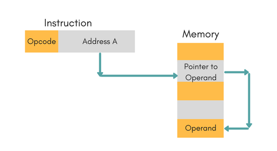
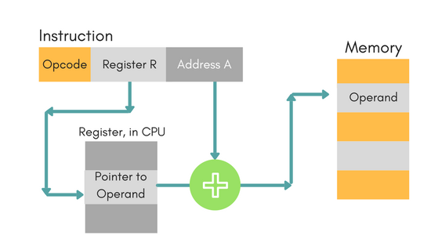

## Basics of Computers

Flat memory could be described as named(addressed) boxes and we have many of them.
**Basic** data structures are created as combine(stick) them. Cells are the building blocks.
On top of them could create a complex one.

Basic ones are: String, Array, Record. Having structures functions are needed to work on them - **instructions**.
The length of the instructions is fixed so particular amount of memory could be addressed(reached). To address
even more **indirect** addressing was invented. It is also used for easy access to composite structures
such as arrays.

To be our machine _Turing complete_ we need also instructions for **conditions**,
**loops** and **assignment**

If error occurs during instruction execution we set flag on some spacial place in memory.

So this is enough but for convenience large programs should be divided to larger functions.
To achieve this we need a convention how to pass parameters and how to receive results.
That's why **activation records** was invented.

## Two's Complement

Two's complement is a **clever way** of storing integers so that **common** math problems
are very simple to implement.

- for _zero_, use all 0's.
- for _positive integers_, start counting up to `2^(number of bits - 1) - 1`.
- for _negative integers_, up to `2^(number of bits)`. One more, this is because of zero.

Some special cases:
```
Number        Exponent   Signiticand
-------------------------------------------------
Zero          00000000   00000000000000000000000
Denormalized  00000000   Any nonzero value
Infinity      11111111   00000000000000000000000
Not a Number  11111111   Any nonzero value
```

### Distinguishing between positive and negative numbers

Doing this, the first bit gets the role of the "sign" bit, as it can be used to distinguish
between non negative and negative decimal values. If the **most significant bit** is `1`, then
the binary can be said to be _negative_, where as if the **most significant bit** (the leftmost) is `0`,
you can say the decimal value is non negative.

## Kinds of instructions

### Structure of the instruction

If the _indirect bit_ is set we have indirect addressing.
The _operation code_ or _ops code_ are should be validated by assembler.

`R1` (8-11 bits) – is a register or mask.
`R2` (12-15 bits) - index register designator (kind of pointer) or register

`address` - address in the memory. Most commonly label address is set here.

### Register to Register (RR)

This is the easy part - `R2` is always a register. We have two cases depending from the indirect bit

#### Direct addressing
If it is `0` we deal with two registers. Example:
```
LR, 2 1    ; Move contenet of register 1 in regiter 2
```

#### Indirect register addressing
If it is `1` means that R2 should be _pointer_(address) to the real data (second operand). Assembler parse it and set
address in R2. When the opcode is 'interpreted' the _address field_ is filled with the current content of the
address location. Example:
```
L, 0  *15    ; Load the content of the memory address stored at register 15 to register 0.
```
Register indirect addressing means that the location of an operand is held in a register.
It is also called _indexed addressing_ or _base addressing_.

Register indirect addressing mode requires three read operations to access an operand.

- Read the instruction to find the pointer register
- Read the pointer register to find the oprand address
- Read memory at the operand address to find the operand

### Register and Storage (RS)

#### Indirect bit is 0, R2 is not set and address field is set
In this case we work with register and data situated in that address (in most cases it is a label). Example:
```
BAL, 15 Add  ; 'Add' is a lable
```

#### Indirect bit is 0, R2 is set and address field is set
It is used to define offset. Works like previous case except that we add the value of R2 to the address in
address field. Example:
```
BAL, 15 Square + 4   ; 'Square' is a lable(address) and the 4 is the offset and assembler place it in R2
```

_Indirect addressing_ may be used for code or data. It can make implementation
of pointers, array elements acces, references, or handles much easier, and can
also make it easier to call subroutines which are not otherwise addressable.
Indirect addressing does carry a performance penalty due to the extra memory
access involved. Also using it significant bigger memory could be addressed.

Also OS place program in the `data segment` which address is unknown during assembling.
In this way OS should pass only start address of the `data segment` and program works using offsets
from this staring point. No need to recalculate addresses. Assembler program should do the calculations
and use one of the following.

Example:

```
Indirect addressing allows you to reference memory locations, larger than the operand limit R2.

1 | ADD 2 *3
2 | ...
3 | *32000      ;; address may exceed the operand size limit
...
32000 | 42

This will add memory location 2 and 3, 3 points to location 32000, so when it's evaluated, the effect is:

1 | ADD 2 42
```
#### Indirect bit is 1, R2 is not set and address field is set
Kind of _pointer to pointer_. Address filed points to the pointer(situated) in memory. From that address we
obtain second operand. Example:

```
BAL, 15 *(Square + 4)  ;; like array in an array access
```



#### Indirect bit is 1, R2 is set and address field is set
Same as previous one except that R2 adds offset. Could be used to work with composite structures when OS place
them _at the end_ of the memory space. If offset from the beginning is bigger and do not fit in previous - use this one.



## Assembler syntax

Note that the assembler syntax is not defined in book. So you have to think about what
should include as directives, macros and how to define offsets(pointer arithmetic).

## Example Assembler Program from book

Changes from books assembler:
- additional comments
- comments starts with `;`
- directives starts with `.`

```
;
; This program tests the Pythagorean relation on the values stored at
; X, Y, and Z. The external procedure 'Square' (result in reg. 1)
; is used to calculate the square of a value and is entered one word
; past its head (offset). That's why we do + 4 to find the real start
; address of Square. The symbol 'Good' goes on the map only.
;
; NOTE: ICL = Program Counter (PC)

   .DEF Pythagoras  ; Identifies one or more symbols that are defined in current module
                    ; and that can be used in other modules.

   .REF Square      ; Identifies one or more symbols used in the current module that are
                    ; defined in another module. Linker will handle this.
   .MAP Good        ; The MAP directive sets the origin of a storage map to a specified address.
                    ; The storage-map location counter, is set to this address

;
; Helper function. With given values in registers 1 and 2
; returns the sum in reg 2.
;
Add         FAR,  2  1    ; Sum reg 1 and reg 2 (the result goes in reg 2)
            BCRR, 0  *15  ; Procedure return.
                          ; If ICL is 0 we return to the address that reg 15 contains

; pow(Х) + pow(Y) = pow(Z)
Pythagoras  L,   1   X           ; Load what we have in X. Then the
            BAL, 15  Square + 4  ; content of the current ICL is moved to reg 15
                                 ; and the address of Square is placed in ICL. It's kind of
                                 ; calling a procedure.

            LR,  2   1           ; The result from reg 1 (Square procedure place result there)
                                 ; we move to reg 2

            L,   1   Y           ; For Y we do the same. Reg 1 contains the result.
            BAL, 15  Square + 4  ; What we achieve: pow(X) in reg 2 and
                                 ;                  pow(Y) in reg 1

            BAL, 15  Add         ; Having this we can sum them
                                 ; and the result(pow(X) + pow(Y)) goes in reg 2

            L,   1   Z           ; For Z we do the same and result is in reg 1
            BAL, 15  Square + 4

            FSR, 1   2           ; reg 2 (pow(X) + pow(Y)) we compare with reg 1 (pow(Z))
            BCS, 1   Good        ; Branching condition. If they are the same go to lable Good,
            SVC, 7   False       ; else make interrupt with code 7 ('F' is displayed)
            SVC, 0   0           ; and exit. For codes see: Exceptions and supervisor calls

Good        SVC, 7   True        ; Interrupt with code 7 ('T' is displayed)
            BCRR,0   *14         ; and exit with "success" - so 0 in reg 14
                                 ; The programmer who use Pythagoras must know that
                                 ; the result is in reg 14

; Define constants

True        .DSC     'T'         ; DSC - defines char
False       .DSC     'F'

X           .DSF     3.          ; DSF - defines real
Y           .DSF     4.
Z           .DSF     5.

            .END     Pythagoras  ; Ends program

```

### Assembler Syntax

#### EBNF

```
<Program>   ::= <Start> <Sections> <End>
<Start>     ::= .DEF <Name>
<End>       ::= .END <Name>
<Section>   ::= <Header Directive> <Procedures>

<Header Directives> ::= (empty)
                     | .REF
                     | .MAP

...

```

### Operating System

- How logically memory should be divided?
- BIOS to load OS in proper memory location

#### Minimal OS functionality

- Basic OS functions
  `initArray`, `checkArrayBounds`, `allocRecord`, `print`, `flush`,
  `size`, `getchar`, string operations (`concat`, `substring`, etc.), `not`, `main` and `exit`

- _Kernel trap_ should be written in assembly language to handle interrupts

#### Notes

  - Directives starts with `dot`

  - `.MAP` directive
The map file contains all the static symbols (functions, globals, etc.) in your
code and their relative addresses. Depending on your linker(next chapter) settings, it may
have other information, such as the address of each line of code in your
program. If your program crashes, it is possible to determine where the crash
occurred using the map file.

  - Indirect addressing starts with `star`
  - Pointer arithmetic include following expressions: plus and minus needed for offset
    (e.g. `Square + 4`, `Square - 4`)
  - Char e.g. `'T'`
  - Real/Float numbers ends with `dot`
  - Registers are refereed just with plain number in range `0..15`
  - Labels are strings (note that they are without `:` at the end)
  - Comments starts with `;`
  - Like in other assembler (MIPS for example) it is good idea to create convention
    for register usage.
  - Add `.data` and `.text`

```
    ;; Subprogram1/Label1:

        .data
        ;; Variables for subprogram 1

        .text
        ;; Subprogram body

        ret

    ;; Subprogram2/Label2:

        .data
        ;; Variables for subprogram 2

        .text
        ;; Subprogram body

        ret

    ;; Main program/MainLable:

        .data
        ;; Variables for main

        .text
        ;; Main body

        ret
```
Why use multiple `.text` and `.data` sections in a program?
Variables should be defined along with the subprogram that uses them, for the sake of readability.

### Book

_"MIPS Assembly Language Programming"_ by Robert Britton
