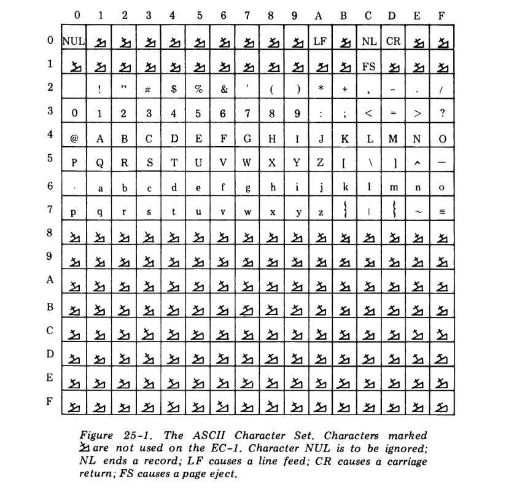
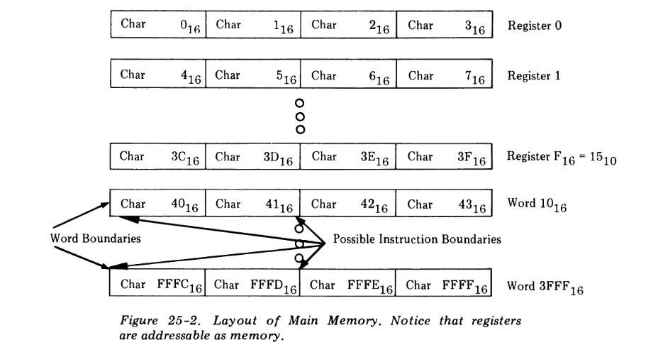

## Statement of the Theme

Write a simulator for the EC-1 computer. Input for the simulator should be an absolute load file
and the input stream for the simulated program. The basic output should be the output stream from the program.
In addition to the simulator, write at least two programs for the EC-1 to test the simulator's correctness.
Of course, you will have to hand-assemble these programs into absolute load file format.

Besides the basic output, your simulator should be able to trace and dump the simulated program.
The trace should show the instruction broken down, the effective address calculation, and the
operands and results in both their natural and hexadecimal formats. A dump should include the
memory printed (perhaps under option control) in hexadecimal, instruction mnemonics, integer,
real, and character formats. Repetitious groups of data should be printed only once with a note of
the repetition. Control of the trace and dump may go directly to the simulator, perhaps via a
console, or may be driven by supervisor calls during execution.


## EC-1 computer

```EC-1``` is simpler than many hardware computers, but this aspect allows more attention to be paid to the
structure. The description may not be as complete and detailed as might be found in a computer manual; such
completeness would require more space than we have available. _You will have to use what you know of other
computers to fill the gaps._ Throughout, numeric items will be represented in hexadecimal notation (base 16)
because it fits nicely on the machine.


## Memory and registers

Each EC-1 is supplied with ```2^16``` 8-bit characters of memory, addressed from 0 to ```2^16 - 1```. Each
memory position can hold any one of the 256 characters from the ASCII character set.

Each block of four contiguous characters beginning with a character whose address is evenly divisible
by four is a ```word```. Words participate in a number of operations, and the character boundary immediately
to the left of a word is a ```word boundary```.

Computations are done in a set of 16 word-size ```general-purpose registers``` numbered from 0 to 15.
These registers lie over the first 64 characters of memory, and any reference to a character address
in the range 0 to 63 references the corresponding character in the register block instead. Some
instructions require a register designator to be treated as a character address, which is done by
multiplying the designator by four. We note here that bits in a word, character, or what have you
will always be numbered from zero on the left.



Two other registers are available. The ```Instruction Location Counter``` (_ILC_) always points to the next
instruction to be executed in normal sequence. The ```Condition Code Register``` (_CCR_) is four bits
wide. The **CCR** is generally set as a side effect of instruction execution and may be tested by branch
instructions. The four bits are named, from left to right, the _overflow bit_, the _greater than bit_, the
_less than bit_, and the _equals bit_. When the **CCR** is set by an instruction, it is first cleared entirely to
zero and then affected bits are set to one. An overflow causes only the overflow bit to be set.
Testing the **CCR** does not affect its value.


## Hardware data types

Characters have been mentioned above. They are sometimes regarded as positive 8-bit integers.
Words may contain 32-bit _two's complement_ integer values. Bit 0 of a word is the _sign position_ and
is zero for positive values and one for negative values (this is a function of two's complement
notation). When shorter signed integers, such as the immediate operands discussed below, are combined
with words, the shorter value has its sign bit propagated leftward to fill the missing bits.



_Real numbers_ also occupy a word. Bit 0 is the sign bit, bits 1 through 7 constitute the _exponent_,
and bits 8 through 31 the _fraction_. In a positive real number, the sign bit is zero, the exponent field
contains an excess `40hex`(`excess-7` system) exponent of 16, and the fraction contains a 24-bit normalized hexadecimal
fraction with an assumed hexadecimal point on its left.

NOTE: Excess 40(hex) notation means that the true exponent is found by subtracting `40hex`(or 7 dec) from the recorded exponent.
      _Excess-M_ representation also called **offset binary** representation.

Normalization of the hexadecimal fraction requires that at least the leftmost hexadecimal digit be nonzero
if any are. If the fraction becomes zero, the entire number is set to zero. Any final result of a real arithmetic
operation that cannot be expressed because of limits on exponents causes a _real format exception_. **Negative**
real numbers are the _two's complements_ of the corresponding positive values. Special short real values are used
in real immediate instructions and have their rightmost three fraction digits dropped.


## Instruction formats

Instructions occur in **short** two-character format and **long** four-character format. All instructions
must begin on even-character boundaries; failure of the `ILC` to contain an even address at the
beginning of an instruction execution cycle causes an _illegal instruction address exception_. The first
character of every instruction contains the _indirect bit_ in bit 0 and the _operation code_ (the ```opcode```) in
bits 1 through 7. Not all opcodes are meaningful and not all instructions make use of the indirect
bit. An illegal opcode causes an _unimplemented instruction exception_. In most instructions, bits 8
through 11 designate either a general register or a 4-bit literal value used as a mask, and bits 12
through 15 designate a second general register.

Basically, there are four kinds of instructions: ```register-to-register``` (the two-character instructions),
```register-and-storage```, ```immediate```, and ```character```. Each class has its own characteristic interpretation
and addressing algorithm detailed here:

1. ```Register-to-register``` (```RR```) . In all register-to-register instructions, bits 12 through
15 designate a register used as one operand of the instruction. If the indirect bit is on, the operand is
located at the address given by bits 16 through 31 of the register designated by bits 12 through 15 of the
instruction. The value in bits 8 through 11 may designate either a register or a mask.
Instructions **CCS** and **MCS** do not make use of the indirect bit.

2. ```Register-and-Storage``` (```RS```). Register-and-storage instructions usually use bits 8 through 11
to designate a register or form a 4-bit mask to be used as one operand. The rest of the
instruction is used to form an _effective address_ with this algorithm:

   If the indirect bit is 0 and the _index register designator_ (bits 12 through 15) is 0,
   the effective address is given by the _address field_ (bits 16 through 31) of the
   instruction.

   If the indirect bit is zero and the index register designator is nonzero, the address field
   is extended to the left with zeros and added (two's complement, of course) to the
   value in the index register. Bits 16 through 31 of the result form the affected address.
   The value in the index register is not changed.

   If the indirect bit is nonzero and the index register designator is zero, the address field
   names a two-character _indirect field_ in memory. The contents of the indirect field
   form the effective address. If the indirect field does not begin on an even-character
   boundary, an _indirect address exception_ occurs.

   If both the indirect bit and the index register designator are nonzero, the indirect
   field is added to the index register value and the rightmost 16 bits of the sum form
   the effective address. An indirect address exception may occur.

3. ```Immediate``` (```IM```). All immediate instructions use bits 8 through 11 to designate a target
register and bits 12 through 31 to hold an _immediate operand_. The immediate operand
may be a 20-bit two's complement integer, a 20-bit logical vector, or a short-format real
number. The indirect bit is ignored by immediate instructions.

4. ```Character``` (```CH```). Character instructions operate the same way as register-and-storage
instructions.


## Exceptions and supervisor calls

NOTE: Probably you have to implement some kind of miniOS.

The input/output structure on modern computers is at least as complicated as the CPU. To avoid
doubling the size of the problem, we assume that a **supervisor** monitors the progress of every user
program. The supervisor can be invoked directly by the Supervisor Call instruction and indirectly
by an exceptional occurrence. The Supervisor Call instruction uses its various fields to code the
function desired and to supply parameters. The following constitute a bare minimum of functions
with the R1 register designator selecting the function.

   ```R1 = 0``` Exit the running program and clean up after it.

   ```R1 = 1``` Read an integer from the input stream and store it at the effective address of the
         SVC (the address must name a word).

NOTE: See SVC (supervisor call) instruction in instruction set description.

   ```R1 = 2``` Read a real number and store it at the effective address.

   ```R1 = 3``` Read a character and store it at the effective address.

   ```R1 = 4``` Cause the input stream to space ahead to a new record.

   ```R1 = 5``` Write the word at the effective address as an integer on the output stream.

   ```R1 = 6``` Write the word at the effective address on the output stream as a real number.

   ```R1 = 7``` Write the character at the effective address to the output stream.

   ```R1 = 8``` Write an end of record on the output stream.

   ```R1 = 9``` and ```R2 = 0``` End tracing instruction execution.

   ```R1 = 9``` and ```R2 = 1``` Begin tracing instruction execution. Print a running record of each
         instruction executed.

   ```R1 = A``` The effective address of the SVC must be a word address. The low half`word
         gives the low address and the high halfword the high address of a section of memory to
         dump. The dump should display memory between the limits in both hexadecimal and
         character-string format. You may find it useful to display instruction mnemonics also.
         The dump routine should notice and not print duplicated lines.

   ```R1 = F``` This supervisor call will never be assigned for system use and can be used for any
         purpose by the simulator.

It is assumed that integers and real numbers on the input/output streams are terminated by blanks.
Exceptions occur when errors arise during the course of instruction execution. The program is
interrupted and the supervisor notified of the cause of the exception and the location of the offending
instruction. A summary of exceptions follows.

   **Illegal Instruction Address.** At the start of an instruction execution cycle, the `ILC` does
      not contain an even value.

   **Unimplemented Instruction.** There is no operation defined for this operation code.

   **Indirect Address.** The indirect address is not even.

   **Word Addressing.** The address of a purported word operand to an instruction is not
      divisible by four.

   **Real Format.** The result of some real-valued operation cannot be expressed within the
      format for normalized real numbers.

   **Execute Address.** The effective address of an Execute instruction is not even.

   **Zero Divisor.** The divisor in a division or remainder operation is zero.

   **Wraparound Instruction.** A four-character instruction begins at _FFFE_.

The response of the supervisor to an exception is left to the implementor but should include a
report to the user of the occurrence.
